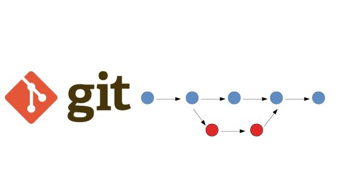

# Инструкция по работе с GIT

+ [Базовые команды](#chapter-0)
+ [Команды для ветвления](#chapter-1)
+ [Заметки](#chapter-2)

# Базовые команды

*git init* – **инициализация локального репозитория**

*git status* – **получить информацию от git о его текущем состоянии**

*git add* – **добавить файл или файлы к следующему коммиту**

*git commit -m “message”* – **создание коммита.**

*git log* – **вывод на экран истории всех коммитов с их хеш-кодами**

## Команды для ветвления 

*git branch* -**команда для вывода всех веток на экран**
 
 *git branch <branch_name>* - **создание новой ветки**

 *gti checkout <branch_name>* - **Переход на другую ветку**
 
 *git merge <branch-name>* - **Слияние веток между собой**

*git branch -d <branch_name>* - **Удаление уже слитой ветки**

*git log --graph*  - **Вывод журнала изменений с визуализацией**

## Команды для удаленного репозитория
*git clone <URL>* - **клонирование удаленного репозитория на локальный**

*git push* - **Отправка изменений с локального репозитория на удаленный**

*git pull* - **Стягивание изменений с удаленного репозитория на локальный**

*git remote add origin* - **фиксация ветки в удалленом репозитории**

*branch -M <branch_name>* **изменение названия основной ветки**

---

### Заметки

для перехода от ветки к ветке необходимо возвращаться к родительской ветке:
* __Правильно:__  
    *master -> seminar_1 - >master -> seminar_2*
* __Неправильно:__  
     *master -> seminar_1 -> seminar_2*

***

*git diff <file_name>* **Изменения в файле относительно последнего коммита**

*git diff* **Измения в нескольких файлах**

*git diff 5562fa353 d5e73e4b2 index.html* **Изменения в файле между двумя коммитами**

*git blame <file_name>* **Покажет коммиты, когда были изменены и кем**

## Отмена несохранённых изменений

*git restore <file_name>* **удаляет сделанные изменения в файле**

*git restore --staged <file_name>* **Возвращает файл из индекса, если он там находится**

*git reset --hard* **Удаляет сделанные изменения в нескольких файлах, но не работает с файлами которые имеют статус “untracked”**

*git clean -f* **Удаляет файлы со статусом “untracked”**

*git rm --cached <file_name>* **Дает команду Git прекратить отслеживание файла**

## Отмена сохранённых изменений

*git checkout <hash commit> <file_name>* **Возвращает файл к определенному коммиту, данный файл переносится в индекс либо можно отменить изменения командой “git reset --hard”для нескольких файлов и git restore --staged index.html для одного файла**

*git revert <hash commit>* **отменяет коммит целиком**

Указатель HEAD - указатель на последний коммит текущей ветки

*git reset* - **отмена или сброс коммитов**
* soft - сбрасывает изменения до указанного коммита и переводит файл в индекс *git reset --soft <hash commit>* 
* mixed - сбрасывает изменения до указанного коммита и переводит файлы в недобавленные в индекс состояния *git reset --mixed <hash commit>*
* hard - изменения в последующих коммитах удаляются безвозвратно

*git commit --amend -m 'new comment'* **Изменение наименования последнего коммита**

    *git add .*
    *git commit --amend --no-edit* **добавить файл в существующий коммит**
## Отмена слияния веток

*git reset --merge hash* **отменяет слияние**

*git merge --abort* **Отменяет слияние если произошел конфликт при слиянии**

## Откладывание изменений
*git stash* **Откладывание изменений**

*git stash pop* **возврат более ранних изменений из отложенных**

*git stash drop* **отмена отложенных изменений**

*git stash list* **Список всех отложенных изменений**

## Перемещение изменений

